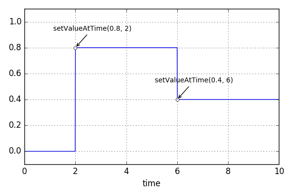
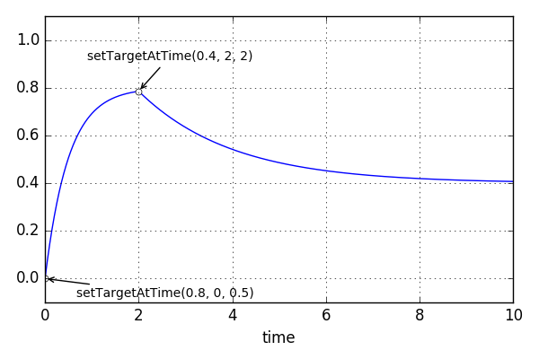
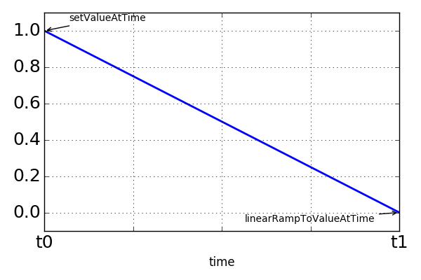
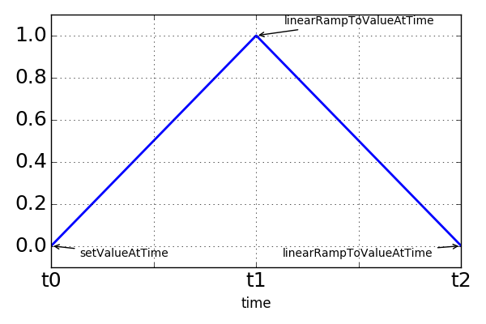
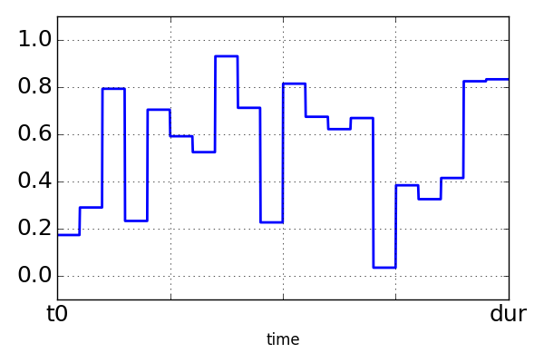
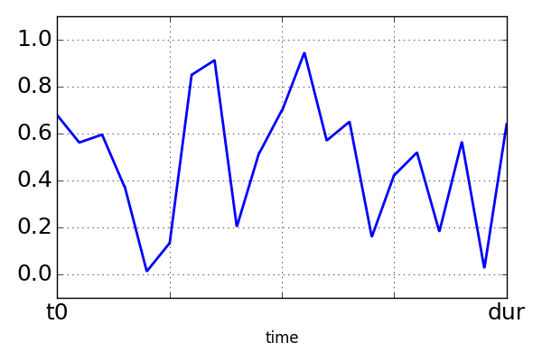
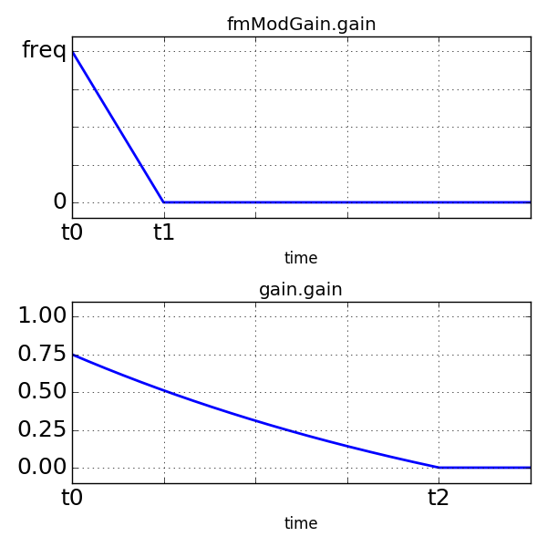

# lesson02

このページではオーディオノードのパラメーターとスケジューリングについて説明します。

## オーディオノードのパラメーター

多くのオーディオノードは変更可能なパラメーター（属性）を持っています。たとえば、`GainNode`はゲイン比率のパラメーターを持っており、それを使ってオーディオグラフを流れる音声のゲイン比率を制御します。

これまでに使用した`GainNode`と`OscillatorNode`のパラメーターは次のとおりです。

### GainNodeのパラメーター

| 名前 | データ型 | 説明 |
|------|----------|-
| gain | AudioParam | ゲイン比率（単純な倍率。マイナス値だと極性が反転する）

ゲイン比率をデシベルで指定したい場合は、次の関数で変換できます。

```js
function dbtoa(db) {
  return Math.pow(10, db * 0.05);
}
```

### OscillatorNodeのパラメーター

| 名前 | データ型 | 説明 |
|------|----------|-
| type | string | 波形の種類（"sine", "square", "sawtooth", "triangle"）
| frequency | AudioParam | 周波数
| detune    | AudioParam | デチューン（1200で1オクターブ）
| onended   | function   | 再生終了時のコールバック関数

周波数をMIDIノート番号で指定したい場合は、次の関数で変換できます。

```js
function mtof(midi) {
  return 440 * Math.pow(2, (midi - 69) / 12);
}
```

`dbtoa()`、`mtof()`関数を使った例です。

```js
/* editor */
function mtof(midi) {
  return 440 * Math.pow(2, (midi - 69) / 12);
}
function dbtoa(db) {
  return Math.pow(10, db * 0.05);
}
function synth(t0, midi, db) {
  var t1 = t0 + 1;
  var oscillator = audioContext.createOscillator();
  var gain = audioContext.createGain();

  oscillator.type = "sawtooth";
  oscillator.frequency.value = mtof(midi);
  oscillator.start(t0);
  oscillator.stop(t1);
  oscillator.connect(gain);

  gain.gain.value = dbtoa(db);
  gain.connect(audioContext.destination);
}

synth(audioContext.currentTime, 69, -12);
```

各オーディオノードのパラメーター・メソッドについては次のページの一覧がよくまとまっています。

- [Web Audio API 解説 - 18.各ノードのパラメータ一覧 | g200kg Music & Software](http://www.g200kg.com/jp/docs/webaudio/paramlist.html)

## オーディオパラメーター

オーディオノードのパラメーターでもっとも重要なのがオーディオパラメーター（[AudioParam](http://g200kg.github.io/web-audio-api-ja/#AudioParam)）です。ここまでの例でも、`oscillator.frequency.value = 880;`としてオシレーターの周波数を設定したり、`gain.gain.value = 0.5;`としてゲイン比率を設定していました。オーディオパラメーターは値を設定するだけでなく、値の変化を正確な時間でスケジュールすることができます。さらに、他のオーディオノードの出力を自身のスケジュールされた値に加算することができます。オーディオパラメーターはエンベロープやLFOによるモジュレーション、フィルタのスウィープなどで使用されます。

スケジューリングの必要がなく、オーディオパラメーターに値をセットするだけの場合は`value`プロパティを使用します。

```js
oscillator.frequency.value = 880;
```

スケジューリングが必要な場合は、パラメーターの変化に応じたいくつかのメソッドを使用します。

### setValueAtTime(value, startTime)



```js
gain.gain.setValueAtTime(0.8, 2);
gain.gain.setValueAtTime(0.4, 6);
```

`startTime`に`value`の値となるようにスケジュールします。このメソッドは離散的な変化や、後述する`linearRampToValueAtTime()`メソッドや`exponentialRampToValueAtTime()`メソッドの開始地点を指定するために使います。

```js
/* editor */
function synth(t0, dur) {
  var t1 = t0 + dur * 0.2;
  var t2 = t1 + dur * 0.4;
  var t3 = t2 + dur * 0.4;
  var oscillator = audioContext.createOscillator();
  var gain = audioContext.createGain();

  oscillator.start(t0);
  oscillator.stop(t3);
  oscillator.connect(gain);
  oscillator.onended = function() {
    gain.disconnect();
  };

  gain.gain.value = 0.05; // わかりやすさのため0の代わりにしています
  gain.gain.setValueAtTime(0.8, t1);
  gain.gain.setValueAtTime(0.4, t2);
  gain.connect(audioContext.destination);
}

synth(audioContext.currentTime, 3);
```

### linearRampToValueAtTime(value, endTime)


```js
gain.gain.setValueAtTime(0, 0);
gain.gain.linearRampToValueAtTime(0.8, 2);
gain.gain.linearRampToValueAtTime(0.4, 6);
```

`endTime`に`value`の値に到達するよう線形関数的に変化させます。このメソッドは変化の到達点を指定するので事前に`setValueAtTime()`メソッドで開始地点を指定する必要があります。

```js
/* editor */
function synth(t0, dur) {
  var t1 = t0 + dur * 0.2;
  var t2 = t1 + dur * 0.4;
  var t3 = t2 + dur * 0.4;
  var oscillator = audioContext.createOscillator();
  var gain = audioContext.createGain();

  oscillator.start(t0);
  oscillator.stop(t3);
  oscillator.connect(gain);
  oscillator.onended = function() {
    gain.disconnect();
  };

  gain.gain.setValueAtTime(0, t0);
  gain.gain.linearRampToValueAtTime(0.8, t1);
  gain.gain.linearRampToValueAtTime(0.4, t2);
  gain.connect(audioContext.destination);
}

synth(audioContext.currentTime, 3);
```

### exponentialRampToValueAtTime(value, endTime)


```js
gain.gain.setValueAtTime(0.001, 0);
gain.gain.exponentialRampToValueAtTime(0.8, 2);
gain.gain.exponentialRampToValueAtTime(0.4, 6);
```

`endTime`に`value`の値に到達するよう指数関数的に変化させます。このメソッドは変化の到達点を指定するので事前に `setValueAtTime()`メソッドで開始地点を指定する必要があります。指数関数的な変化は比率による変化なので0からの変化や0への変化、符号をまたいだ変化はできません。

```js
/* editor */
function synth(t0, dur) {
  var t1 = t0 + dur * 0.2;
  var t2 = t1 + dur * 0.4;
  var t3 = t2 + dur * 0.4;
  var oscillator = audioContext.createOscillator();
  var gain = audioContext.createGain();

  oscillator.start(t0);
  oscillator.stop(t3);
  oscillator.connect(gain);
  oscillator.onended = function() {
    gain.disconnect();
  };

  gain.gain.setValueAtTime(0.001, t0);
  gain.gain.exponentialRampToValueAtTime(0.8, t1);
  gain.gain.exponentialRampToValueAtTime(0.4, t2);
  gain.connect(audioContext.destination);
}

synth(audioContext.currentTime, 3);
```

### setTargetAtTime(target, startTime, timeConstant)



```js
gain.gain.setTargetAtTime(0.8, 0, 0.5);
gain.gain.setTargetAtTime(0.4, 2, 2);
```

`startTime`から`target` の値に向かって漸近的に変化します。`linearRampToValueAtTime()`メソッドや `exponentialRampToValueAtTime()`メソッドと違って開始時間を指定するのが特徴です。パラメーターの値は`timeConstant`秒経過後に目標の63％に到達するように変化します。上のグラフの例では最初の`setTargetAtTime()`開始の0.5秒後に`0.8 * 0.63 => 0.504`を通過しています。

```js
/* editor */
function synth(t0, dur) {
  var t1 = t0 + dur * 0.2;
  var t2 = t1 + dur * 0.8;
  var oscillator = audioContext.createOscillator();
  var gain = audioContext.createGain();

  oscillator.start(t0);
  oscillator.stop(t2);
  oscillator.connect(gain);
  oscillator.onended = function() {
    gain.disconnect();
  };

  gain.gain.value = 0;
  gain.gain.setTargetAtTime(0.8, t0, dur/20);
  gain.gain.setTargetAtTime(0.4, t1, dur/5);
  gain.connect(audioContext.destination);
}

synth(audioContext.currentTime, 3);
```

### setValueCurveAtTime(values, startTime, duration)


```js
function sigmoid(length, amount) {
  var values = new Float32Array(length);

  for (var i = 0; i < values.length; i++) {
    var x = ((i / values.length) - 0.5) * -amount * 2;
    var y = 1 / (1 + Math.pow(Math.E, x));

    values[i] = y;
  }

  return values;
}

var values1 = sigmoid(1000, 5);

gain.gain.setValueCurveAtTime(values1, 0, 4);
```

_注意: ここの記述は仕様に即していますが、実情には即していません。_

`startTime`から`duration`秒かけて配列`values`の値に基づいて変化します。`linearRampToValueAtTime()`メソッドや`exponentialRampToValueAtTime()`メソッドでは難しい任意の変化をつけたいときに使用します。配列の値は線形補間されます。

> #### 補足: 線形補間の実際
> 2016年6月の時点では線形補間されるのは Chrome のみです。Firefox 46やSafari 9では補間されません。ですので、なめらかな曲線を描きたい場合は配列の要素数を大きくとる必要があります。

```js
/* editor */
function sigmoid(length, amount) {
  var values = new Float32Array(length);

  for (var i = 0; i < values.length; i++) {
    var x = ((i / values.length) - 0.5) * -amount * 2;
    var y = 1 / (1 + Math.pow(Math.E, x));

    values[i] = y;
  }

  return values;
}

function synth(t0, dur, values) {
  var t1 = t0 + dur;
  var oscillator = audioContext.createOscillator();
  var gain = audioContext.createGain();

  oscillator.start(t0);
  oscillator.stop(t1);
  oscillator.connect(gain);
  oscillator.onended = function() {
    gain.disconnect();
  };

  gain.gain.value = 0;
  gain.gain.setValueCurveAtTime(values, t0, dur);
  gain.connect(audioContext.destination);
}

synth(audioContext.currentTime, 3, sigmoid(1000, 5));
```

### cancelScheduledValues(startTime)

`startTime` 以降にスケジュールされているパラメーター変化をキャンセルします。

> #### 補足: スケジューリングの注意点
> 2016年6月の時点ではひとつのオーディオパラメーターにスケジュールを登録し続けると、だんだん遅くなる症状が出ます。経験的には1000を超えるようなスケジュール登録は避けたほうが良く、長時間の演奏などでどうしても必要な場合は、定期的に`cancelScheduledValues()`メソッドでスケジュールをキャンセルして、新しく登録しなおすなどの工夫が必要です。

## オーディオパラメーターのスケジュールを確認する

スケジューリングされたパラメーター変化を確認するには次のサイトが便利です。

- [audio-param-viewer](http://the.mohayonao.com/web-audio-api/audio-param-viewer/)

## オーディオノードからの接続


オーディオパラメーターはオーディオノードから接続されることができます。オーディオノードが接続されたパラメーターは`value`プロパティやスケジュールメソッドによって計算される値と、接続したオーディオノードの値を加算します。次の例では`OscillatorNode`の`frequency`に別の`OscillatorNode`を接続してビブラートを掛けています。

```js
/* editor */
function synth(t0, dur) {
  var t1 = t0 + dur;
  var oscillator = audioContext.createOscillator();
  var gain = audioContext.createGain();
  var lfo = audioContext.createOscillator();
  var lfoGain = audioContext.createGain();

  oscillator.frequency.value = 440;
  oscillator.start(t0);
  oscillator.stop(t1);
  oscillator.connect(gain);
  oscillator.onended = function() {
    gain.disconnect();
  };

  gain.gain.value = 0.5;
  gain.connect(audioContext.destination);

  lfo.frequency.setValueAtTime(0, t0);
  lfo.frequency.linearRampToValueAtTime(10, t1);
  lfo.start(t0);
  lfo.stop(t1);
  lfo.connect(lfoGain);

  lfoGain.gain.setValueAtTime(0, t0);
  lfoGain.gain.linearRampToValueAtTime(20, t1);
  lfoGain.connect(oscillator.frequency);
}

synth(audioContext.currentTime, 5);
```

## エンベロープ

次によく使うエンベロープのパターンを列挙します。

### 減衰



```js
/* editor */
function synth(t0, decay) {
  var t1 = t0 + decay;
  var oscillator = audioContext.createOscillator();
  var gain = audioContext.createGain();

  oscillator.start(t0);
  oscillator.stop(t1);
  oscillator.connect(gain);
  oscillator.onended = function() {
    gain.disconnect();
  };

  gain.gain.setValueAtTime(0.5, t0);
  gain.gain.linearRampToValueAtTime(0.0, t1);
  gain.connect(audioContext.destination);
}

synth(audioContext.currentTime, 5);
```

### 三角



```js
/* editor */
function synth(t0, attack, decay) {
  var t1 = t0 + attack;
  var t2 = t1 + decay;
  var oscillator = audioContext.createOscillator();
  var gain = audioContext.createGain();

  oscillator.start(t0);
  oscillator.stop(t2);
  oscillator.connect(gain);
  oscillator.onended = function() {
    gain.disconnect();
  };

  gain.gain.setValueAtTime(0.0, t0);
  gain.gain.linearRampToValueAtTime(0.5, t1);
  gain.gain.linearRampToValueAtTime(0.0, t2);
  gain.connect(audioContext.destination);
}

synth(audioContext.currentTime, 2, 3);
```

### 台形


```js
/* editor */
function synth(t0, attack, sustain, decay) {
  var t1 = t0 + attack;
  var t2 = t1 + sustain;
  var t3 = t2 + decay;
  var oscillator = audioContext.createOscillator();
  var gain = audioContext.createGain();

  oscillator.start(t0);
  oscillator.stop(t3);
  oscillator.connect(gain);
  oscillator.onended = function() {
    gain.disconnect();
  };

  gain.gain.setValueAtTime(0.0, t0);
  gain.gain.linearRampToValueAtTime(0.5, t1);
  gain.gain.setValueAtTime(0.5, t2);
  gain.gain.linearRampToValueAtTime(0.0, t3);
  gain.connect(audioContext.destination);
}

synth(audioContext.currentTime, 1, 2, 2);
```

### ランダム1

離散的に変化するランダムカーブの例です。ここでは関数を定義してカーブの設定を行っています。



```js
/* editor */
function applyStepCurve(param, t0, dur, values) {
  for (var i = 0; i < values.length; i++) {
    param.setValueAtTime(values[i], t0 + (i / values.length) * dur);
  }
  return param;
}

function synth(t0, dur, values) {
  var t1 = t0 + dur;
  var oscillator = audioContext.createOscillator();
  var gain = audioContext.createGain();

  applyStepCurve(oscillator.frequency, t0, dur, values);

  oscillator.start(t0);
  oscillator.stop(t1);
  oscillator.connect(gain);
  oscillator.onended = function() {
    gain.disconnect();
  };

  gain.gain.value = 0.5;
  gain.connect(audioContext.destination);
}

var values = new Float32Array(100);

for (var i = 0; i < values.length; i++) {
  values[i] = 440 * Math.pow(4, Math.random() - 0.5);
}

synth(audioContext.currentTime, 5, values);
```

### ランダム2

連続して変化するタイプのランダムカーブです。ここでも関数を定義してカーブの設定を行っています。



```js
/* editor */
function applyExpRampCurve(param, t0, dur, values) {
  for (var i = 0; i < values.length; i++) {
    if (i === 0) {
      param.setValueAtTime(values[i], t0);
    } else {
      param.exponentialRampToValueAtTime(values[i], t0 + (i / (values.length - 1)) * dur);
    }
  }
  return param;
}

function synth(t0, dur, values) {
  var t1 = t0 + dur;
  var oscillator = audioContext.createOscillator();
  var gain = audioContext.createGain();

  applyExpRampCurve(oscillator.frequency, t0, dur, values);

  oscillator.start(t0);
  oscillator.stop(t1);
  oscillator.connect(gain);
  oscillator.onended = function() {
    gain.disconnect();
  };

  gain.gain.value = 0.5;
  gain.connect(audioContext.destination);
}

var values = new Float32Array(100);

for (var i = 0; i < values.length; i++) {
  values[i] = 440 * Math.pow(4, Math.random() - 0.5);
}

synth(audioContext.currentTime, 5, values);
```

## 課題

[lesson02](quizzes/lesson02) / [解答例](quizzes/lesson02/answer.html)

タップすると音の出る2オペレーターFM音源のウェブオーディオアプリケーションです。

1. 次のオーディオグラフを参考にオーディオノードをそれぞれ接続する
2. `modGain`と`gain`にそれぞれエンベロープを設定する
  - `modGain`は線形関数的変化、`gain`は指数関数的変化させる




_ヒント: `modGain` はキャリア周波数と同じくらいの値で増幅するとそれっぽくなります_

---
更新日付：2016-06-10
