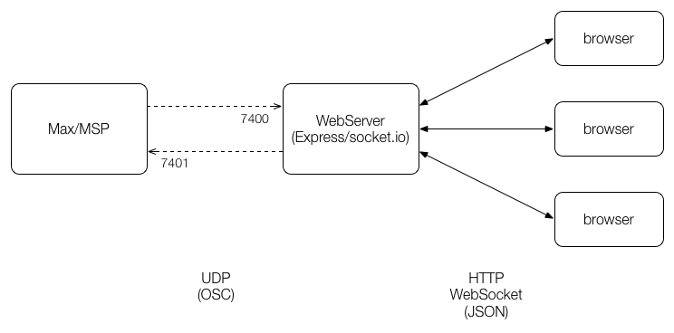
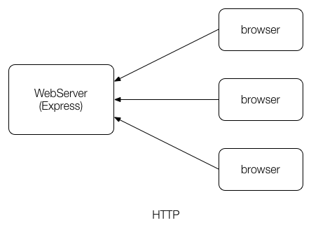
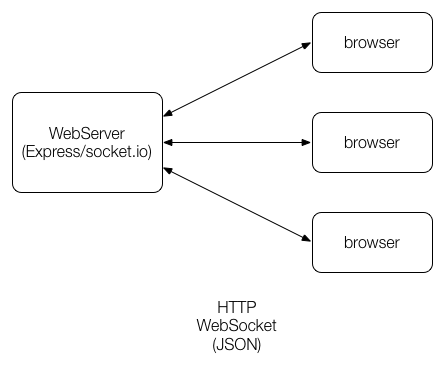
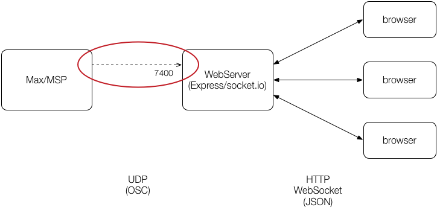

# lesson05

このページでは[OSC](https://ja.wikipedia.org/wiki/OpenSound_Control)を使った外部アプリケーションとのやりとりについて説明します。

## システム構成

OSCは一般にUDPでメッセージのやり取りをします。しかしブラウザではUDPを使ってデータの送信・受信を行うことはできません。そこで、このテキストではWebSocketを使ってウェブサーバーとブラウザ間のメッセージをやり取りして、外部アプリケーションとはウェブサーバー経由でメッセージをやり取りする方法を紹介します。

システム全体の構成は次のとおりです。ウェブアプリケーションフレームワークに[`Express`](http://expressjs.com/ja/)、WebSocketを扱うのに[`socket.io`](http://socket.io/)というライブラリをそれぞれ使用しています。



## JSONによるOSC表現

このシステムはウェブサーバーでOSCメッセージを受信して、それを[JSON](https://ja.wikipedia.org/wiki/JavaScript_Object_Notation)に変換してブラウザへ転送します。OSCメッセージとJSONの相互変換には[osc-msg](https://github.com/mohayonao/osc-msg)というライブラリを使っています。JSONの表記方法については次のサイトが分かりやすいです。

- [非エンジニアに贈る「具体例でさらっと学ぶJSON」 ｜ Developers.IO](http://dev.classmethod.jp/etc/concrete-example-of-json/)

JSONでのOSC表現は次のとおりです。

- "address"というキーにOSCメッセージのアドレス
- "args"というキーにはOSCメッセージのデータ配列
- データは"type"という型情報と"value"というデータ値で構成


```js
{
  "address": "/foo",
  "args": [
    { "type": "integer", "value": 0 },
    { "type": "integer", "value": 1 },
    { "type": "integer", "value": 2 }
  ]
}
```

ただし、データの型は省略することができます。数値でデータ型を省略した場合はfloatとして解釈されます。


```js
{
  "address": "/foo",
  "args": [ 3, 4, 5, "hello" ]
}
```

OSCメッセージをデコードした場合は型情報付きのJSONデータとなります。

このシステムではJSONにデコードしたOSCメッセージに対して次の処理を行い、さらにJavaScriptで使いやすいように変換しています。

```js
// OSCメッセージをJSONに変換する
var oscMessage = osc.toObject(oscData);

// バンドルの場合は最初の要素をメッセージとする (oF対応)
if (oscMessage.elements) {
  oscMessage = oscMessage.elements[0];
}

// 値の型情報を省略する
oscMessage.args = oscMessage.map(function(value) {
  return value.value;
});
```


## クライアントサイドプログラミング

ウェブサーバーで`socket.io`を使っている場合は、次のように`<script>`タグで`socket.io`用のクライアントライブラリを読み込みます。

```html
<script src="/socket.io/socket.io.js"></script>
```

`socket.io`用のクライアントライブラリを読み込むと`io()`関数が使えるようになります。この関数を呼び出すとウェブサーバーにソケット接続します。

```js
var webSocket = io();
```

ウェブサーバーからのデータを受信するには、`on()`メソッドで対象となるイベントに対するコールバック関数を登録します。
次の例ではウェブサーバーから"osc"というイベントが発行されたときに呼び出されるコールバック関数を登録しています。

```js
webSocket.on("osc", function(msg) {
  console.log(msg.address);
  console.log(msg.args);
});
```

ウェブサーバーへデータを送信するには、`emit()`メソッドを使います。
次の例ではウェブサーバーのソケットオブジェクトに"osc"イベントとして、JSONを送信しています。

```js
webSocket.emit("osc", { address: "/osc", args: [ 1, 2, 3 ] });
```

## サーバーサイドプログラミング

### ウェブサーバーをたてる



`Express`を使用して簡単なウェブサーバーを起動するには次のように書きます。このサーバープログラムでは、プログラムの設置されているディレクトリをウェブページのルートに設定しています。つまり、サーバープログラムを起動してブラウザで[`http://127.0.0.1:8000`](http:/127.0.0.1:8000)にアクセスすれば、プログラムと同じ階層にある`index.html`が表示されます。

```js
// 必要なモジュールを読み込む
var http = require("http");
var express = require("express");

// ウェブサーバーの設定
var PORT = 8000;
var HOSTNAME = "0.0.0.0";

// ウェブサーバーのインスタンスを生成する
var server = http.createServer(app);

// このプログラムのあるディレクトリをウェブページのルートとする
app.use(express.static(__dirname));

// ウェブサーバーの起動
server.listen(PORT, HOSTNAME);
```

プログラムは次のように起動します。停止するときは`Ctrl+C`です。

```
node server
```

### ウェブソケット



`socket.io`では前段で生成したウェブサーバーインスタンス（`server`）を使用してソケットサーバーインスタンス（`webSocket`）を生成します。

```js
// 必要なモジュールを読み込む
var socketIO = require("socket.io");

// ウェブソケットインスタンスを生成する
var webSocket = socketIO(server);

webSocket.on("connect", function(socket) {
  // ブラウザからソケット接続があった時にここが呼ばれる
  // socket にはブラウザとの接続情報が格納されている

  socket.on("osc", function(msg) {
    // ブラウザから"osc"イベントが送信された時にここが呼ばれる
  });

  socket.on("disconnect", function() {
    // ブラウザから切断された時にここが呼ばれる
  });

  // ブラウザへ"osc"イベントを発行する時は emit() メソッドを使う
  socket.emit("osc", { address: "/connected" });

  // すべてのソケット接続に対してイベントを発行する時は webSocket の emit() メソッドを使う
  webSocket.emit("osc", { address: "/connected" });
});
```

### OSCを受信する



```js
// 必要なモジュールを読み込む
var dgram = require("dgram");
var oscmsg = require("osc-msg");

// 受信ポートの設定
var OSC_RECV_PORT = 7400;

// 受信ポートの生成
var recvOSCSocket = dgram.createSocket("udp4");

// 受信ポートを開く
recvOSCSocket.bind(OSC_RECV_PORT, "127.0.0.1");

recvOSCSocket.on("message", function(buffer) {
  // OSCメッセージを受信した時にここが呼び出される

  // OSCメッセージをJSONに変換する
  var msg = osc.fromBuffer(buffer);

  // JavaScriptで扱いやすい形式に変換する
  if (msg.elements) {
    msg = msg.elements[0];
  }
  msg.args = msg.args.map(function(value) {
    return value.value;
  });
});
```

### OSCメッセージを送信する


```js
// 送信ポートの設定
var OSC_SEND_PORT = 7401;

// 送信用の関数
function sendOSCMessage(msg) {
  var buffer = osc.toBuffer(msg);
  var socket = dgram.createSocket("udp4");

  socket.send(buffer, 0, buffer.length, OSC_SEND_PORT, "127.0.0.1");  
}
```

## 課題

[lesson05](quizzes/lesson05) / [解答例](quizzes/lesson05/answer.html)

タップすると音の出るウェブオーディオアプリケーションです。OSCを使って別の端末でも音が出るようにしてください。

1. `index.html`を編集して`socket.io`ライブラリを読み込む
2. `sendTapMessage()`関数を実装してOSCを送信する
  - メッセージの内容は `/tap midi amp x y` とする
3. OSCを受信して`synth()`関数を呼び出す
4. 動作確認用に `quizzes/lesson05/echo.maxpat` を使用する

---
更新日付：2016-06-10
